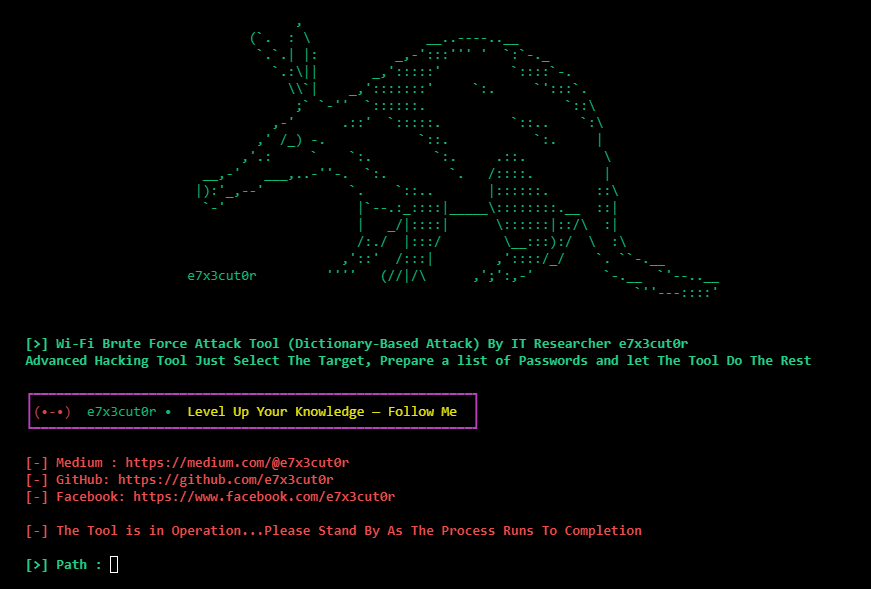

## 📡 WBFA Tool — Advanced WiFi Brute Force
### (Dictionary-Based Attack)

## 📌 Overview
WPFA is a Sophisticated Attack Tool Programmed By **e7x3cut0r** That is Designed To Perform A Brute Force Attack on Wi-Fi Networks And Is An Effective Tool For Breaking weakly Protected Networks.
Just Select Your Target, Provide the Passwords File, And let The Tool Do The Work 😈

## ✨ Features
- 🖥 User-Friendly Interface  😈
- ⚙ Lightweight But Deadly 
- 🚀 Fast and Furious
- 📶 Support for Networks That Derive Passwords from MAC Addresses
- 📊 Resume Your Attack Where You Left Off — without losing Progress

## 🛠 Installation

    

  

## 📚 Documentation

  
To View a Detailed Guide On How to use it, check it on Medium:

  

